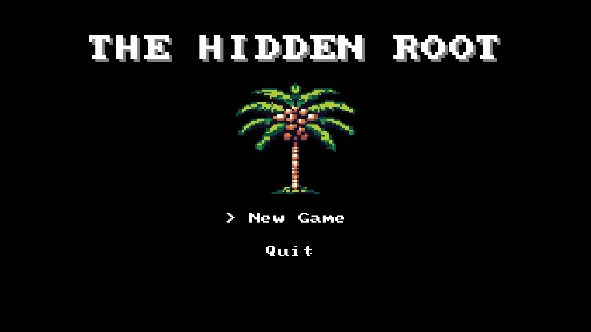
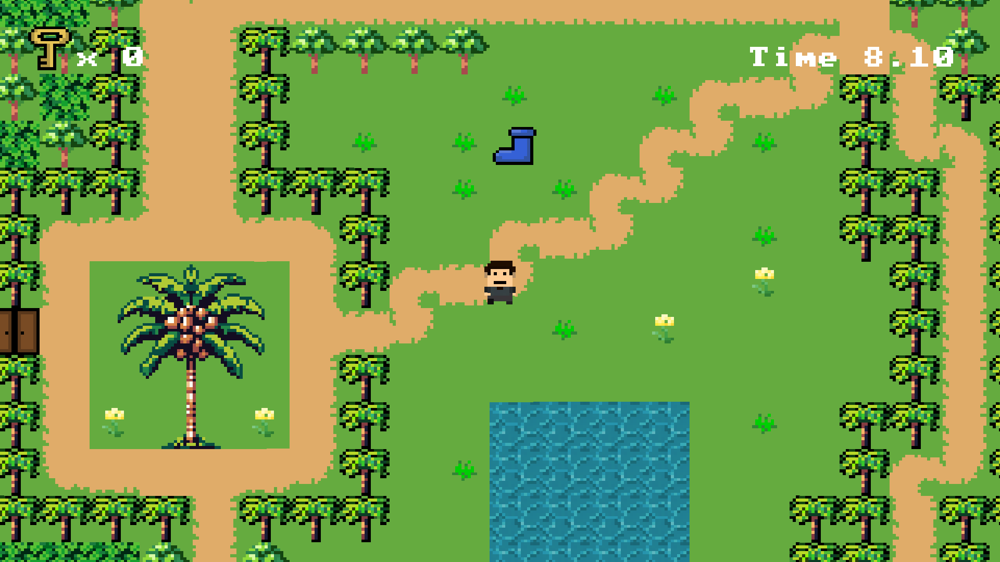

# The Hidden Root: Java 2D Game

## 1-About the Project
[cite_start]This project is a 2D graphics game developed entirely in Java[cite: 25]. [cite_start]It was built to explore core game design mechanics and object-oriented programming principles[cite: 29]. [cite_start]Designed as a treasure hunter game [cite: 22][cite_start], the application operates in a two-dimensional space where objects are represented as flat images (sprites) on a coordinate grid[cite: 33]. 

[cite_start]To make the gameplay more competitive, an SQL database was integrated to track players' score times and manage a dynamic leaderboard.

## 2-Application Previews
* **Main Menu:** 

* **Gameplay:** 

## 3-How We Built It
[cite_start]The game relies on a continuous game loop that cycles through input handling, logic updates, and rendering to ensure a responsive, real-time experience[cite: 35, 36, 37, 38]. 

Here are the core technical components implemented in the project:
* [cite_start]**Rendering Engine:** Built utilizing standard Java libraries like AWT for rendering graphics, sprites, and UI elements[cite: 39, 40].
* [cite_start]**World Generation:** The game world uses tile-based rendering, where the map is represented as a 2D array and populated with individual tile images[cite: 74, 75].
* [cite_start]**Camera System:** The viewport tracks the player's position, rendering only the visible portion of the world using coordinate offsets[cite: 88, 89, 90].
* [cite_start]**Collision Detection:** Object interaction is managed through bounding box collision, which checks for intersections between the rectangles surrounding game objects[cite: 95, 96].
* [cite_start]**Game State Management:** The flow of the game is controlled via enumerated types, allowing smooth transitions between the Title Screen, Playing state, and Game Over screen[cite: 119, 120, 121, 122, 130].
* [cite_start]**Leaderboard Database:** An SQL database records player completion times and scores, adding a competitive edge to the game.
* [cite_start]**Audio:** Background atmosphere and sound effects are powered by the `javax.sound.sampled` library[cite: 110].
* [cite_start]**Assets & Soundtracks:** Visual assets were sourced and created using Pixilart and Gamedeveloperstudio [cite: 138][cite_start], while 8-bit audio tracks were sourced from Uppbeat[cite: 140].

## 4-Contributors
[cite_start]This project was a collaborative effort by the following team members[cite: 31]:
* Abdullah Mohammad Alhasawi
* Anas Al-Jumaiah
* Ibrahim Alborsias
* Khalid Sami Almuhaysh

## 5-Legal and Academic Disclaimer
[cite_start]This project was developed for academic purposes as part of the Object-Oriented Programming 2 (OOP2) curriculum at King Faisal University's College of Computer Sciences and Information Technology[cite: 29]. The project was supervised by M Shujah Islam Sameem. [cite_start]All third-party assets (audio and tile sheets) belong to their respective creators and are used here strictly for educational, non-commercial purposes[cite: 138, 140].
